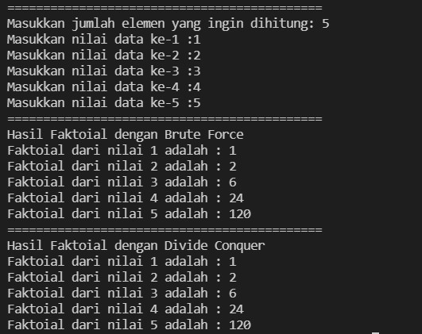
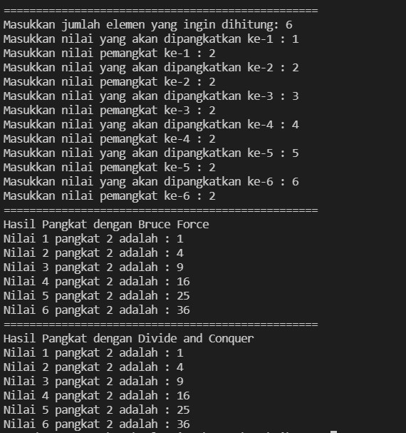
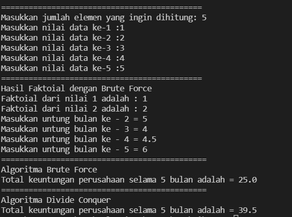
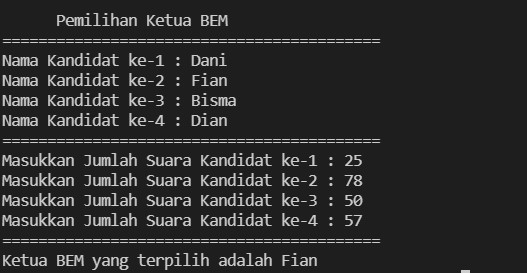

**JOBSHEET IV**

**BRUTE FORCE DAN DIVIDE CONQUER**

Nama : Andhito Galih Nur Cahyo

Kelas : 1F

No absen : 06

Nim : 2141720138


**4.2.1 Langkah-langkah Percobaan**

**4.2.2 Verifikasi Hasil Percobaan** 

Cocokkan hasil compile kode program anda dengan gambar berikut ini.


**Jawab:**



**4.2.3 Pertanyaan**
1. Jelaskan mengenai base line Algoritma Divide Conquer untuk melakukan pencarian nilai faktorial!
2. Pada implementasi Algoritma Divide and Conquer Faktorial apakah lengkap terdiri dari 3 tahapan divide, conquer, combine? Jelaskan masing-masing bagiannya pada kode program!
3. Apakah memungkinkan perulangan pada method faktorialBF() dirubah selain menggunakan for?Buktikan!
4. Tambahkan pegecekan waktu eksekusi kedua jenis method tersebut!
5. Buktikan dengan inputan elemen yang di atas 20 angka, apakah ada perbedaan waktu eksekusi?

**Jawab**

1. if (n==1) return 1; jika nilai yang akan dimasukkan nantinya adalah 1 maka hasil yang akan ditampilkan oleh program main nantinya adalah 1 dan berfungsi sebagai batas dari divide conquer dimana perulangan kali akan berakhir saat n sudah sama dengan 1.
2. Divide : membagi masalah menjadi beberapa masalah yang memiliki kemiripan dengan masalah semua namun berukuran lebih kecil.Conquer : menyelesaikan masing-masing masalah secara rekursifCombine : menngabungkan solusi masing-masing masalah sehingga membentuk solusi masalah semula
    
    ```
    public int faktoialDC(int n){
        if(n == 1){ //ini adalah divide
            return 1; //ini adalah conquer + combine
        }else{ //ini adalah divide
            int fakto = n* faktoialDC(n-1); //ini adalah conquer
            return fakto; //ini adalah combine
        }
    }
    ```

3. Bisa, selama termasuk looping maka jenis looping apapun bisa digunakan pada method faktorialBF() dan saya sudah mencoba membuktikannya dengan looping jenis while danprogram tetap berjalan dengan baik.

        ```
        public int faktoialBF(int n){
            int fakto = 1;
            int i=0;
            while(i<=n){
                fakto *= i;
                i++;
            }
            return fakto;
        }
        ```
4.  - Code:
        ```
        long awal = System.currentTimeMillis();
        long selesai = System.currentTimeMillis();
        long time = selesai - awal;
        System.out.println("Waktu Eksekusi : "+String.valueOf(time)+" milidetik");
        ```
5. Ada, yaitu bisa terlihat pada output yang dihasilkan bahwa jumlah inputan mempengaruhi waktu eksekusi karena inputan itu juga di proses

### **4.3 Menghitung Hasil Pangkat dengan Algoritma Brute Force dan Divide and Conquer** 

**4.3.1 Langkah-langkah Percobaan** 

**4.3.2 Verifikasi Hasil Percobaan** 

**Jawab:**



**4.3.3 Pertanyaan** 

1. Jelaskan mengenai perbedaan 2 method yang dibuat yaitu PangkatBF() dan PangkatDC()! 

2. Pada method PangkatDC() terdapat potongan program sebagai berikut: 

3. Apakah tahap *combine* sudah termasuk dalam kode tersebut?Tunjukkan! 

4. Modifikasi  kode  program  tersebut,  anggap  proses  pengisian  atribut  dilakukan  dengan konstruktor. 

5. Tambahkan menu agar salah satu method yang terpilih saja yang akan dijalankan! 

**Jawab**
1.  - Method PangkatBF():
        - method PangkatBF() menggunakan perulangan "for".
        - method PangkatBF() langsung menentukan nilai hasil itu sama dengan 1 dan menghitung menggunakan perulangan, yaitu hasil = hasil * nilai a. setelah syarat dari perulangan sudah tidak terpenuhi/berhenti maka nilai dari hasil akan direturn-kan.
    - Method PangkatDC():
        - method PangkatDC() menggunakan pemilihan "if-else".
        - method PangkatDC() membaginya terlebih dahulu, yakni menggunakan pemilihan.
        - Jika nilai dari n = 0, maka nilainya akan bernilai 1.
        - Jika tidak, maka dibagi lagi dengan menggunakan pemilihan lagi, yaitu dengan membagi nilai ganjil dan genap.
        - Jika nilai pangkat itu ganjil, contoh: angka = 2, pangkat = 3.--> ((2, 3/2)*(2,3/2)*2)) -->((2,1)*(2,1)*2) --> ((2*2)*(1*1)*2) = 8.
        - Sedangkan nilai pangkat itu genap, contoh: angka = 2, pangkat 4 --> ((2, 4/2)*(2,4/2)*2)) -->((2,2)*(2,2)*2) --> (2*2)*(2*2) = 16.

2.  - Jika nilai pangkat itu ganjil, contoh: angka = 2, pangkat = 3.--> (    (2, 3/2)*(2,3/2)*2)) -->((2,1)*(2,1)*2) --> ((2*2)*(1*1)*2) = 8.
    - Sedangkan nilai pangkat itu genap, contoh: angka = 2, pangkat 4 --> ((2, 4/2)*(2,4/2)*2)) -->((2,2)*(2,2)*2) --> (2*2)*(2*2) = 16.

3.  Sudah termasuk, yaitu:
    ```
    if(n%2==1){ //ini adalah divide
        return (pangkatDC(a, n/2)*pangkatDC(a, n/2)*a); //ini adalah conquer + combine
    }else{
        return (pangkatDC(a, n/2)*pangkatDC(a, n/2)); //ini adalah conquer + combine
    }
    ```

4. 
    ```
    public void Pangkat (int a, int n){
        nilai = a;
        pangkat = n;
    }
    ```

5. - Code:
    ```
    class MainPangkat_pertanyaan{
        public static void main(String args[]) {
            Scanner sc = new Scanner(System.in);
            char ulang;
            do{
            System.out.println("=================================================");
            System.out.print("Masukkan jumlah elemen yang ingin dihitung: ");
            int elemen = sc.nextInt();
            
            Pangkat_pertanyaan[] png = new Pangkat_pertanyaan[elemen];
            
            for(int i=0; i<elemen; i++){
                png[i] = new Pangkat_pertanyaan();
                System.out.print("Masukkan nilai yang akan dipangkatkan ke-"+(i+1)+" : ");
                png[i].nilai = sc.nextInt();
                System.out.print("Masukkan nilai pemangkat ke-"+(i+1)+" : ");
                png[i].pangkat = sc.nextInt();
                }
            System.out.println("=================================================");
            System.out.println("Pilihan Perhitungan");
            System.out.println("1. Brute Force");
            System.out.println("2. Divide and Conquer");
            System.out.println("=================================================");
            System.out.print("Masukkan pilihan Anda: ");
            int pil = sc.nextInt();
            
            switch(pil){
            case 1:
                System.out.println("=================================================");
                System.out.println("Hasil Pangkat dengan Bruce Force");
                for(int i=0; i<elemen; i++){
                    System.out.println("Nilai "+png[i].nilai+" pangkat "+png[i].pangkat+" adalah : "+png[i].pangkatBF(png[i].nilai, png[i].pangkat));
                }
            break;
            case 2:
                System.out.println("=================================================");
                System.out.println("Hasil Pangkat dengan Divide and Conquer");
                for(int i=0; i<elemen; i++){
                    System.out.println("Nilai "+png[i].nilai+" pangkat "+png[i].pangkat+" adalah : "+png[i].pangkatDC(png[i].nilai, png[i].pangkat));
                }
            break;
            default:
                System.out.println("Maaf input yang Anda masukkan salah");
            }
            System.out.println("=================================================");
            System.out.print("Apakah ingin kembali ke menu? (Y/T) : ");
            ulang = sc.next().charAt(0); 
            }while(ulang == 'Y' || ulang == 'y');
        }
    }
    ```
**4.4 Menghitung Sum Array dengan Algoritma Brute Force dan Divide and Conquer** 

**4.4.1 Langkah-langkah Percobaan**

**4.4.2 Verifikasi Hasil Percobaan**

**Jawab**



**4.4.3 Pertanyaan** 
1. Berikan ilustrasi perbedaan perhitungan keuntungan dengan method TotalBF() ataupun TotalDC()
2. Perhatikan output dari kedua jenis algoritma tersebut bisa jadi memiliki hasil berbeda di belakang koma. Bagaimana membatasi output di belakang koma agar menjadi standar untuk kedua jenis algoritma tersebut.
3. Mengapa terdapat formulasi *return* *value* berikut?Jelaskan! 
4. Kenapa dibutuhkan variable mid pada method TotalDC()? 
5. Program perhitungan keuntungan suatu perusahaan ini hanya untuk satu perusahaan saja. Bagaimana  cara  menghitung  sekaligus  keuntungan  beberapa  bulan  untuk  beberapa perusahaan.(Setiap perusahaan bisa saja memiliki jumlah bulan berbeda-beda)? Buktikan dengan program! 

**Jawab:**

1.  
    - Method TotalBF(): Source code lebih mudah dimengerti dan ringkas, lalu menghasilkan algoritma yang standard.
    - Method TotalDC(): Source code tidak lebih mudah dimengerti dari pada method TotalBF(), namun pada method ini memiliki keuntungan, yakni kita dapat memecahkan sebuah masalah yang sulit dan memiliki efisiensi kerja program atau algoritma yang tinggi dan memiliki sistem kerja paralel.
    

2. Dengan memodifikasi baris **println** menjadi **printf** untuk membatasi karakter yang ada. Codenya sebagai berikut:

    ```
    System.out.printf("Total keuntungan perusahaan selama "+sm.elemen+" bulan adalah = %4.2f",sm.totalBF(sm.keuntungan));
    ```

3.  Return value tersebut digunakan untuk mengembalikan nilai dari variabel "lsum", "rsum", dan "arr[mid]", yang mana setiap dari variabel tersebut dijumlahkan terlebih dahulu.


4. Variabel mid dibutuhkan sebagai tempat menyimpan data, yaitu perhitungan "(l+r)/2", yang mana nantinya akan digunakan sebagai pengisian nilai dari salah satu parameter method TotalDC(), yakni arr[].


5. - Code:
    ```
    import java.util.Scanner;
    public class Sum_pertanyaan {
        public int elemen;
        public double keuntungan[];
        public double total;

        Sum_pertanyaan(int elemen){
            this.elemen = elemen;
            this.keuntungan =  new double[elemen];
            this.total = 0;
        }

        double totalBF(double arr[]){
            for(int i=0; i<elemen; i++){
                total = total + arr[i];
            }
            return total;
        }

        double totalDC(double arr[], int l, int r){
            if(l==r){
                return arr[l];
            }else if(l<r){
                int mid = (l+r)/2;
                double lsum = totalDC(arr, l, mid-1);
                double rsum = totalDC(arr, mid+1, r);
                return lsum+rsum+arr[mid];
            }
            return 0;
        }
    }

    class MainSum_pertanyaan{
        public static void main(String args[]) {
            Scanner sc = new Scanner(System.in);
            System.out.println("=============================================================");
            System.out.println("Program Menghitung Keuntungan Total (Satuan Juta. Misal 5.9) ");
            System.out.println("=============================================================");
            System.out.print("Masukkan jumlah perusahaan : ");
            Sum_pertanyaan[] smArray = new Sum_pertanyaan[sc.nextInt()];
            
            for(int i=0; i<smArray.length; i++){
                System.out.println("=============================================================");
                System.out.println("Data perusahaan ke-"+(i+1));
                System.out.print("Masukkan jumlah bulan : ");
                int elemen = sc.nextInt();
                smArray[i] = new Sum_pertanyaan(elemen);
                
                for(int j=0; j<elemen; j++){
                    System.out.print("Masukkan untung bulan ke - "+(j+1)+" = ");
                    smArray[i].keuntungan[j] = sc.nextDouble();
                }
            }
            
            for(int i=0; i<smArray.length; i++){
                System.out.println("=============================================================");
                System.out.println("Hasil perhitungan perusahaan ke-"+(i+1));
                System.out.println("Algoritma Brute Force");
                System.out.printf("Total keuntungan perusahaan selama "+smArray[i].elemen+" bulan adalah = %4.2f%n",smArray[i].totalBF(smArray[i].keuntungan));
                System.out.println("Algoritma Divide Conquer");
                System.out.printf("Total keuntungan perusahaan selama "+smArray[i].elemen+" bulan adalah = %4.2f%n",smArray[i].totalDC(smArray[i].keuntungan, 0, smArray[i].elemen-1)); 
            }
            System.out.println("=============================================================");
        }
    }
    ```
**4.5 Latihan Praktikum** 

1.  Suatu Perguruan Tinggi di kota Malang sedang mengadakan pemilihan suara untuk memilih ketua BEM tahun 2022. Jika jumlah suara yang terkumpul diumpamakan selalu genap. Maka dengan inputan kandidat terpilih, carilah mayoritas jumlah suara untuk masing-masing kandidat. (Jumlah elemen array dan hasil pemilhan suara merupakan inputan user). 

    **Elemen Mayoritas : Elemen mayoritas di dalam A adalah elemen yang terdapat pada lebih dari n/2 posisi. Contohnya, jika n=6 atau n=7 maka nilai mayoritas paling sedikit adalah 4. Berasal dari (7/2)+1 atau (6/2)+1).**  

    Nilai mayoritas berbeda konsep dengan menghitung total suara terbanyak kandidat terpilih !  
    Contoh : Hasil pemilihan suara sebagai berikut (m adalah mayoritas, nm adalah no mayoritas) 

    Karena n = 8, nilai mayoritas paling sedikit sejumlah 5 (8/2+1) 

    Keterangan : Warna Biru adalah proses divide, warna kuning dimulainya proses conquer, warna hijau dimulainya proses combine 

    **Jawab:**

    - Code:

    ```
    public class bem {
        public int vote, jmlVote=0, jmlKandidat=4;
        public String nkandidat;
        public int nilai=1, acc=0, acc2=0,control=0;
        public int[] array = new int[10000];

        public int hitungHasil(int js, int k1, int k2, int k3, int k4){
            if(nilai==5){
                nilai = 1;
            }
            if(nilai == 1 && k1>0){
                array[control] = nilai;
                control++;
                nilai++;
                return hitungHasil(js, k1-1, k2, k3, k4);
            }else if(nilai == 2 && k2>0){
                array[control] = nilai;
                control++;
                nilai++;
                return hitungHasil(js, k1, k2-1, k3, k4);
            }else if(nilai == 3 && k3>0){
                array[control] = nilai;
                control++;
                nilai++;
                return hitungHasil(js, k1, k2, k3-1, k4);
            }else if(nilai == 4 && k4>0){
                array[control] = nilai;
                control++;
                nilai++;
                return hitungHasil(js, k1, k2, k3, k4-1);
            }else if(k1==0 && k2==0 && k3==0 && k4==0){
                if(array[acc] == array[acc+1] && acc + 1<js){
                    return array[acc];
                }else if(acc+2<js){
                    acc +=2;
                    return hitungHasil(js, k1, k2, k3, k4);
                }else{
                    return 0;
                }
            }else{
                nilai++;
                return hitungHasil(js, k1, k2, k3, k4);
            }
        }
    }

    import java.util.Scanner;
    class bemMain{
        public static void main(String args[]){
            Scanner sc = new Scanner(System.in);

            System.out.println("      Pemilihan Ketua BEM     ");
            System.out.println("==========================================");
            
            bem bem = new bem();
            bem[] bem2 = new bem[bem.jmlKandidat];
            for(int i=0; i<bem.jmlKandidat; i++){
                bem2[i] = new Bem();
                System.out.print("Nama Kandidat ke-"+(i+1)+" : ");
                bem2[i].nkandidat = sc.nextLine();
            }
            
            System.out.println("==========================================");
            for(int i=0; i<bem.jmlKandidat; i++){
                System.out.print("Masukkan Jumlah Suara Kandidat ke-"+(i+1)+" : ");
                bem2[i].vote = sc.nextInt();
                bem.jmlVote += bem2[i].vote;
            }
            
            System.out.println("==========================================");
            int hasil = bem.hitungHasil(bem.jmlVote, bem2[0].vote, bem2[1].vote, bem2[2].vote, bem2[3].vote); 
            if(hasil==0){
                System.out.println("Masing-masing kandidat memiliki mayoritas yang hampir sama");
            }else{
                System.out.println("Ketua BEM yang terpilih adalah "+bem2[hasil-1].nkandidat);
            }
        }
    }
    ```

    - Output:

    

